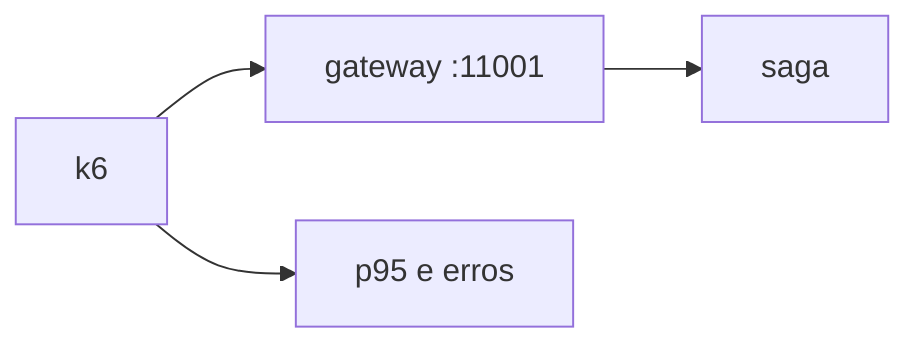

# Lab 11.1 — Baseline de carga no gateway

Tempo previsto: **70 min**. Semana 11. Pré-requisito: k6 instalado.

## Onde você está


Leia da esquerda para a direita. Esta sessão está na **semana 11**. Foco: carga local.


## Figura desta sessão



Leia a figura antes do texto. O texto só nomeia o que a figura já mostrou.

## Objetivo

Medir, não otimizar no escuro.

## 1. Implementar

1. Instale k6: https://grafana.com/docs/k6/latest/set-up/install-k6/
2. Leia o script antes de rodar. Ele faz login e cria poucos pedidos.
3. Não aumente o VU além do que o script diz sem anotar.

## 2. Ver manualmente

1. `k6 run tests/k6/pedido-baseline.js` com a stack no ar.
2. Copie p95, taxa de erro e quantas iterações.
3. Se o threshold falhar, não mude o número para ficar verde. Anote o fato.

## 3. Validar o fluxo integrado

1. Olhe lag do Kafka depois da corrida.
2. Olhe estoque: a corrida consome mouse. Reponha com admin ou reset se precisar.

## 4. Automatizar

1. O script é a automação. Guarde o output no relatório.

## 5. Evoluir

1. Uma corrida só. Soak longo fica como nota, não como obrigação de horas nesta semana.

## Comandos — Windows (PowerShell)

```powershell
k6 run tests/k6/pedido-baseline.js
```

## Comandos — Linux / WSL

```bash
k6 run tests/k6/pedido-baseline.js
```

## Erros comuns

- Rodar contra produção.
- VU alto que enche o disco de log e você não percebe.

## Pistas (leia só se travar)

- O script usa as mesmas senhas de lab. Não troque para senha pessoal.

A solução comentada não fica neste arquivo. Se precisar de gabarito, olhe o comportamento do oráculo (este repositório) e a fonte oficial. Não copie um serviço inteiro.

## Perguntas

- O que você otimizaria primeiro, com este número na mão?

## Entregável

Output do k6 colado no relatório.

## Rubrica

Aprovado se há p95 e uma decisão (manter threshold ou registrar que a máquina não aguenta, sem falsificar).

## Próximo arquivo

[lab-02-seguranca-passiva.md](lab-02-seguranca-passiva.md)
