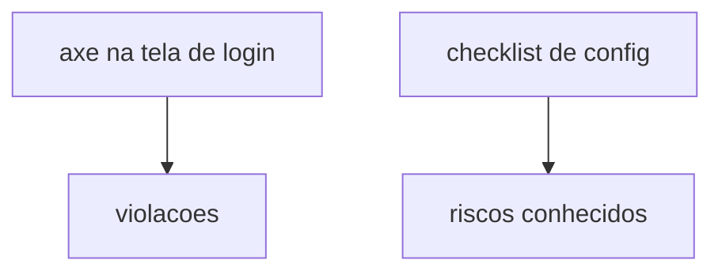

# Lab 11.2 — Checklist e axe

Tempo previsto: **70 min**. Semana 11. Pré-requisito: metas 11.2 e 11.3.

## Onde você está


Leia da esquerda para a direita. Esta sessão está na **semana 11**. Foco: qualidade além do status.


## Figura desta sessão



Leia a figura antes do texto. O texto só nomeia o que a figura já mostrou.

## Objetivo

Juntar acessibilidade e configuração insegura do lab num relatório só.

## 1. Implementar

1. Rode o spec de a11y.
2. Preencha o checklist passivo.

## 2. Ver manualmente

1. Abra a tela de login só com teclado (Tab até o botão). Anote se conseguiu entrar.
2. Isso não está no axe. É o complemento manual.

## 3. Validar o fluxo integrado

1. Nenhum item 'não sei' sem dizer qual arquivo você abriu.

## 4. Automatizar

1. O spec de a11y entra no `npm run e2e` se não estiver marcado como opcional. Veja o nome do arquivo.

## 5. Evoluir

1. Se corrigir um label no oráculo, rode o spec de novo. Não deixe correção sem teste.

## Comandos — Windows (PowerShell)

```powershell
cd apps/web
npx playwright test e2e/a11y.spec.ts
```

## Comandos — Linux / WSL

```bash
cd apps/web && npx playwright test e2e/a11y.spec.ts
```

## Erros comuns

- Scanner apontado para IP público.
- Corrigir CORS do oráculo no meio do curso e quebrar o tutorial sem anotar.

## Pistas (leia só se travar)

- Riscos do oráculo podem permanecer, desde que o checklist os nomeie. Correção séria fica no espelho.

A solução comentada não fica neste arquivo. Se precisar de gabarito, olhe o comportamento do oráculo (este repositório) e a fonte oficial. Não copie um serviço inteiro.

## Perguntas

- Qual achado é de lab de propósito?

## Entregável

Checklist e resultado do axe.

## Rubrica

Aprovado se os dois existem e o teclado foi tentado.

## Próximo arquivo

[lab-03-orcamento.md](lab-03-orcamento.md)
