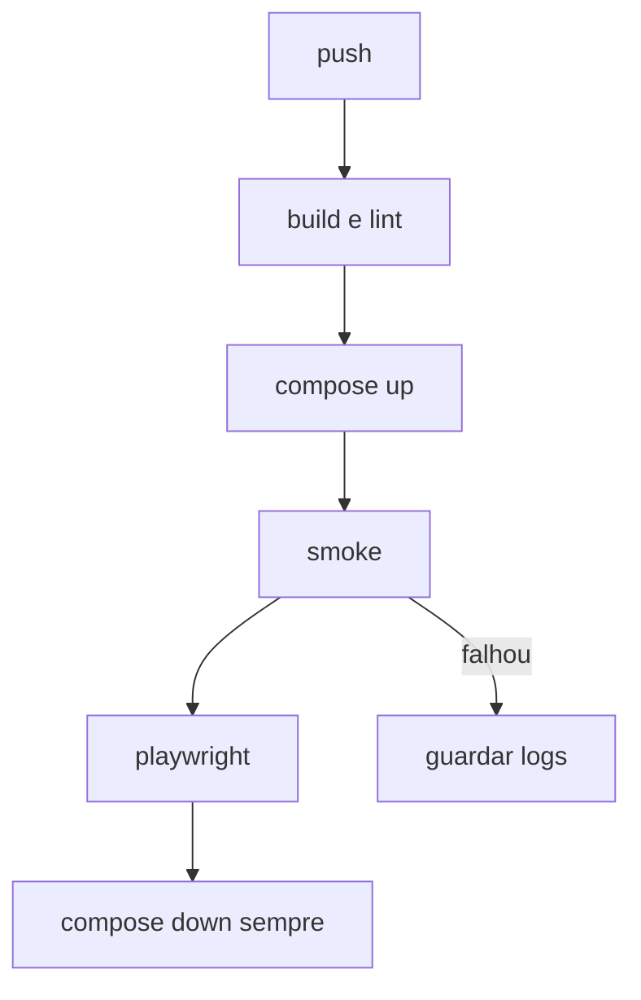

# Lab 12.1 — Ler o workflow e rodar local o que ele roda

Tempo previsto: **70 min**. Semana 12. Pré-requisito: meta 12.1.

## Onde você está


Leia da esquerda para a direita. Esta sessão está na **semana 12**. Foco: CI.


## Figura desta sessão



Leia a figura antes do texto. O texto só nomeia o que a figura já mostrou.

## Objetivo

Executar localmente a espinha do workflow.

## 1. Implementar

1. Leia `.github/workflows/qa-lab.yml` e numere os passos como o diagrama.
2. Rode build de um módulo ou `mvn -DskipTests package` se a máquina aguentar, mais o smoke, mais o e2e se a stack estiver no ar.

## 2. Ver manualmente

1. Se o smoke falhar, olhe o log como o CI faria.
2. Não comente o passo para 'passar'.

## 3. Validar o fluxo integrado

1. O down no final não depende do verde. Confira o `if: always()` no YAML.

## 4. Automatizar

1. O workflow é a automação. Você não recria outro CI paralelo.

## 5. Evoluir

1. Anote o tempo total. Compare com as 8–10 horas da semana: CI é minutos, estudo é o resto.

## Comandos — Windows (PowerShell)

```powershell
Get-Content .github/workflows/qa-lab.yml
```

## Comandos — Linux / WSL

```bash
sed -n '1,200p' .github/workflows/qa-lab.yml
```

## Erros comuns

- Runner sem Docker e o job de compose falha. O YAML precisa dizer isso.
- Segredo de produção no workflow. Não adicione.

## Pistas (leia só se travar)

- O job de documentação só checa se os README das semanas existem.

A solução comentada não fica neste arquivo. Se precisar de gabarito, olhe o comportamento do oráculo (este repositório) e a fonte oficial. Não copie um serviço inteiro.

## Perguntas

- Qual passo você não conseguiu rodar local e por quê?

## Entregável

Lista passo → rodei ou não.

## Rubrica

Aprovado se você leu o YAML e rodou o smoke ou explicou o bloqueio com evidência.

## Próximo arquivo

[lab-02-cronjob.md](lab-02-cronjob.md)
