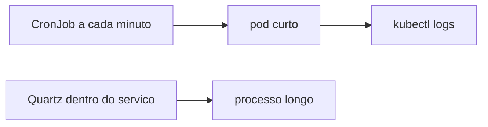

# Lab 12.2 — CronJob no papel e, se houver cluster, no kind

Tempo previsto: **80 min**. Semana 12. Pré-requisito: meta 12.3.

## Onde você está


Leia da esquerda para a direita. Esta sessão está na **semana 12**. Foco: agendamento fora da JVM.


## Figura desta sessão



Leia a figura antes do texto. O texto só nomeia o que a figura já mostrou.

## Objetivo

Explicar quando o agendamento mora no cluster e quando mora no Quartz.

## 1. Implementar

1. Escreva um manifest de estudo (no relatório ou em `docs/academia-qa/semana-12/exemplo-cronjob.yaml` se ele existir) que só imprime a data e termina.
2. Não use esse manifest para apagar banco.
3. Se tiver kind e helm, siga o README do chart e faça port-forward. Se não tiver, entregue o manifest e a comparação com o Quartz.

## 2. Ver manualmente

1. `kubectl get pods` mostra o pod do CronJob completando, se você instalou.
2. Ou você descreve o que veria.

## 3. Validar o fluxo integrado

1. O pedido do oráculo não depende desse CronJob. Escreva isso para não misturar.

## 4. Automatizar

1. O manifest é a automação quando houver cluster. Sem cluster, o entregável é o YAML revisado por você, com `concurrencyPolicy: Forbid` comentado na sua nota.

## 5. Evoluir

1. Compare com o job de 20 segundos da semana 7: CronJob de 1 minuto é grosso demais para aquele prazo.

## Comandos — Windows (PowerShell)

```powershell
kubectl version --client
```

## Comandos — Linux / WSL

```bash
kubectl version --client
```

## Erros comuns

- CronJob que roda o smoke destrutivo em cluster compartilhado. Não faça.
- Achar Jaeger no chart e perder uma hora. O README diz que não está.

## Pistas (leia só se travar)

- infra/helm/study-shop/README.md seção de observabilidade.

A solução comentada não fica neste arquivo. Se precisar de gabarito, olhe o comportamento do oráculo (este repositório) e a fonte oficial. Não copie um serviço inteiro.

## Perguntas

- Por que Forbid evita duas execuções juntas?

## Entregável

Manifest comentado e a comparação com Quartz.

## Rubrica

Aprovado se a comparação cita prazo curto versus cron de plataforma.

## Próximo arquivo

[lab-03-apresentar.md](lab-03-apresentar.md)
