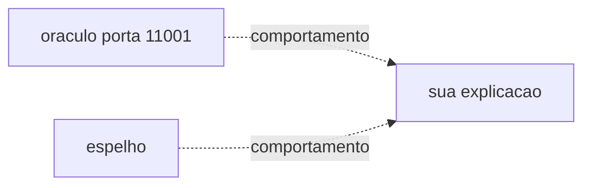

# Lab 12.3 — Apresentar o espelho

Tempo previsto: **90 min**. Semana 12. Pré-requisito: todos os checkpoints que você fez.

## Onde você está


Leia da esquerda para a direita. Esta sessão está na **semana 12**. Foco: capstone.


## Figura desta sessão



Leia a figura antes do texto. O texto só nomeia o que a figura já mostrou.

## Objetivo

Contar o caminho do zero até o ponto em que você parou, com evidência.

## 1. Implementar

1. Rode os validadores: `scripts/academy/validate-checkpoint.ps1 -Checkpoint all` com `ACADEMY_PROJECT_DIR` apontando para o espelho.
2. O que falhar entra na lista de dívida, não é apagado do validador.

## 2. Ver manualmente

1. Para um pedido do oráculo, mostre status final e uma mensagem Kafka.
2. Para o espelho, mostre o equivalente que existir (catálogo, job ou saga).

## 3. Validar o fluxo integrado

1. Preencha `docs/academia-qa/evidencias/templates/portfolio-aluno.md` (cópia sua, fora do git se preferir).
2. Inclua o desenho da arquitetura do espelho.

## 4. Automatizar

1. Não automatize a apresentação. Os testes é que estão automatizados.

## 5. Evoluir

1. Roadmap opcional: `docs/academia-qa/alem/plataforma-de-streaming.md`. Não é obrigatório para passar.

## Comandos — Windows (PowerShell)

```powershell
.\scripts\academy\validate-checkpoint.ps1 -Checkpoint all
```

## Comandos — Linux / WSL

```bash
ACADEMY_PROJECT_DIR=../studyshop-do-zero ./scripts/academy/validate-checkpoint.sh all
```

## Erros comuns

- Dizer que terminou com validador vermelho sem lista de dívida.
- Apresentar só o oráculo.

## Pistas (leia só se travar)

- O hub `docs/academia-qa/README.md` tem a ordem se você se perder na hora de apresentar.

A solução comentada não fica neste arquivo. Se precisar de gabarito, olhe o comportamento do oráculo (este repositório) e a fonte oficial. Não copie um serviço inteiro.

## Perguntas

- Qual risco do oráculo você resolveu no espelho?

## Entregável

Portfolio e saída dos validadores.

## Rubrica

Aprovado se a lista de checkpoints é honesta e pelo menos bootstrap e catalog-api passam.

## Próximo arquivo

[leitura-01-plataforma.md](leitura-01-plataforma.md)
