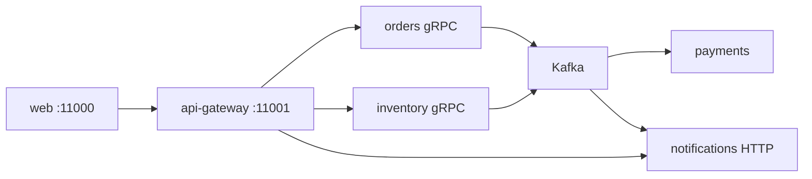

# Arquitetura — StudyShop QA Lab

Visão geral da solução educacional **StudyShop**: e-commerce de estudo focado em microserviços, eventos, gRPC e observabilidade para prática de QA.

## Contexto

O monorepo simula um fluxo de compra completo:

1. Catálogo e estoque (inventory)
2. Criação de pedido (orders)
3. Reserva de estoque e pagamento via saga/eventos (Kafka)
4. Notificações persistidas
5. API HTTP unificada (api-gateway)
6. UI React (web)

Tudo roda localmente via **Docker Compose** (lab completo) ou **Helm** em kind/minikube (deploy K8s educativo).

## Diagrama lógico



Leia da esquerda para a direita. O browser só fala com a web e, por ela, com o gateway.

## Diagrama lógico (texto)

```
                    ┌─────────────┐
                    │    web      │
                    │  (React)    │
                    │   :11000    │
                    └──────┬──────┘
                           │ HTTP
                    ┌──────▼──────┐
                    │ api-gateway │  REST → gRPC / HTTP
                    │   :11001    │
                    └───┬────┬────┘
          gRPC :11003   │    │   gRPC :11005
         ┌──────────────┘    └──────────────┐
         ▼                                  ▼
┌─────────────────┐               ┌──────────────────┐
│ orders-service  │               │ inventory-service│
│ :11002 / :11003 │               │ :11004 / :11005  │
└────────┬────────┘               └────────┬─────────┘
         │                                 │
         │         Kafka topics            │
         └─────────────┬───────────────────┘
                       │
         ┌─────────────┼─────────────┐
         ▼             ▼             ▼
┌──────────────┐ ┌───────────┐ ┌────────────────────┐
│payments-svc  │ │inventory  │ │notifications-svc   │
│   :11006     │ │ (reserve) │ │   :11007           │
└──────────────┘ └───────────┘ └────────────────────┘
         │             │             │
         └─────────────┴─────────────┘
                       │
                       ▼
                 ┌──────────┐
                 │ MongoDB  │  (DBs lógicos por serviço)
                 │ host:11008│
                 └──────────┘
```

## Componentes

| Componente | Responsabilidade | Protocolo |
|------------|------------------|-----------|
| **web** | Catálogo, carrinho, pedidos, admin de estoque, health | HTTP → gateway |
| **api-gateway** | Fachada REST, health agregado, proxy de notificações | REST + gRPC client |
| **orders-service** | CRUD de pedidos, publica `OrderCreated` | HTTP + gRPC + Kafka |
| **inventory-service** | Produtos/estoque, reserva em evento | HTTP + gRPC + Kafka |
| **payments-service** | Consome pedido, simula pagamento | Kafka + Mongo |
| **notifications-service** | Persiste notificações de status | Kafka + REST |
| **mongodb** | Persistência por database lógico | Wire protocol |
| **kafka** | Barramento de eventos (KRaft) | Kafka protocol |

## Fluxo de pedido (saga educacional)

1. Cliente cria pedido via `POST /api/orders` no gateway.
2. Gateway consulta produtos no inventory (gRPC) e chama orders (gRPC).
3. Orders persiste o pedido e publica evento **OrderCreated** no Kafka.
4. Inventory reserva estoque; Payments processa (ou falha se `forcePaymentFailure`).
5. Orders atualiza status a partir dos eventos da saga e publica mudança de status.
6. Notifications grava mensagem. A API lista; a UI atual não mostra notificações.

Estados reais: ver [status-pedido.md](status-pedido.md). Finais: `CONFIRMED` e `CANCELLED`. Não há `COMPLETED` nem `PENDING` neste código.

## Comunicação

- **Síncrona:** REST (browser ↔ gateway) e gRPC (gateway ↔ orders/inventory).
- **Assíncrona:** Kafka entre orders, inventory, payments e notifications.
- **Auth (borda):** JWT Bearer no api-gateway (local HS256 ou OIDC/Keycloak).
- **Auth (serviço):** mTLS opcional no gRPC (overlay Compose).
- **Health:** gateway agrega Actuator HTTP + checagem gRPC do inventory.

## Dados seed (inventory)

| productId | Nome | Estoque inicial |
|-----------|------|-----------------|
| `prod-notebook` | Notebook Study Pro | 10 |
| `prod-mouse` | Mouse Ergonômico | 50 |
| `prod-headset` | Headset QA Focus | 25 |
| `prod-teclado` | Teclado Mecânico | 15 |
| `prod-raro` | Item Escasso | 1 |

## Observabilidade

No Compose: OTel Collector → Jaeger (traces) + Prometheus (métricas) + Grafana (dashboards).

Variáveis `OTEL_*` nos serviços exportam traces OTLP HTTP para `otel-collector:4318`.

## Portas (Compose)

Sequência a partir de **11000** no host:

| Serviço | Host |
|---------|------|
| web | 11000 → 80 |
| api-gateway | 11001 |
| orders | 11002 (HTTP), 11003 (gRPC) |
| inventory | 11004 (HTTP), 11005 (gRPC) |
| payments | 11006 |
| notifications | 11007 |
| mongodb | 11008 → 27017 |
| kafka | 11009 → 19092 (EXTERNAL; apps usam `kafka:9092` na rede Docker) |
| grafana | 11010 → 3000 |
| jaeger UI | 11011 → 16686 |
| prometheus | 11012 → 9090 |
| otel collector | 11013 → 4317, 11014 → 4318 |
| keycloak (overlay oidc) | 11015 → 8080 |
| kafka-ui | 11016 → 8080 |

Internamente (rede Docker/K8s): Mongo permanece em `27017`, Kafka em `9092`, OTel em `4317/4318`.

## Limitações do lab

- Mongo/Kafka single-node, sem TLS/auth (TLS de serviço coberto só no gRPC — Momento 3).
- Sem API gateway de produção (Spring Cloud Gateway avançado, rate limit, etc.).
- Pagamento simulado (flag de falha forçada para QA negativo). Estoque reservado não volta nesse caso.
- Não há scheduler. Pedido intermediário não expira sozinho. Job (Quartz) é estudo do projeto espelho, não deste oráculo.
- Sem DLQ. Falha de listener fica no log.
- Helm não sobe Jaeger/Prometheus/Grafana.
- Charts Helm espelham o Compose de forma didática, não HA.
- JWT local / OIDC / mTLS são perfis de estudo — ver [seguranca.md](seguranca.md).
