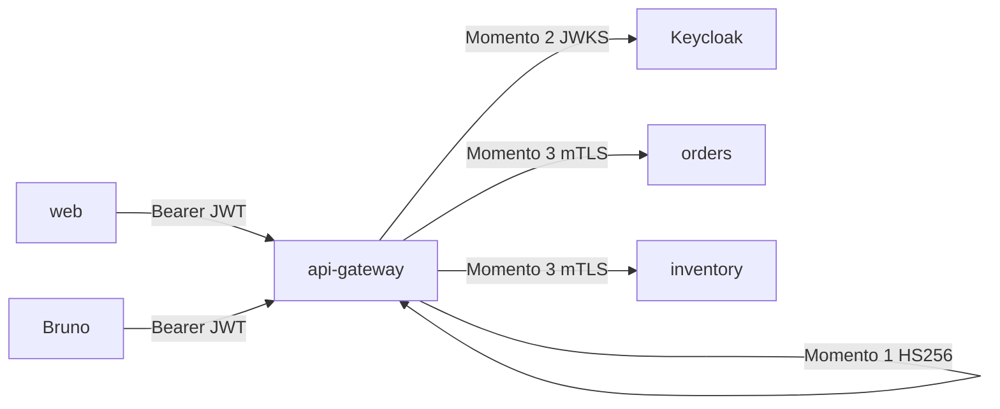

# Segurança — StudyShop QA Lab

Trilha didática em **três momentos**. JWT prova identidade do **usuário** na borda HTTP; mTLS prova identidade do **serviço** no gRPC.

| Momento | Camada | Tutorial |
|---------|--------|----------|
| 1 — JWT local | Browser/Bruno → api-gateway (HS256) | [tutoriais/01-jwt-local.md](tutoriais/01-jwt-local.md) |
| 2 — OIDC/Keycloak | Mesma API, issuer Keycloak (JWKS) | [tutoriais/02-oidc-keycloak.md](tutoriais/02-oidc-keycloak.md) |
| 3 — mTLS gRPC | gateway ↔ orders/inventory | [tutoriais/03-mtls-grpc.md](tutoriais/03-mtls-grpc.md) |

## Matriz de autorização (estável)

| Rota | Acesso |
|------|--------|
| `POST /api/auth/login` | público (só Momento 1) |
| `GET /api/health`, Actuator health, Swagger | público |
| `GET /api/products*` | `USER` ou `ADMIN` |
| `POST/GET /api/orders*` | `USER` ou `ADMIN` |
| `GET /api/notifications*` | `USER` ou `ADMIN` |
| `PUT /api/products/{id}/stock` | só `ADMIN` |

### Usuários seed

| Usuário | Senha | Roles |
|---------|-------|-------|
| `qa` | `qa123` | USER |
| `admin` | `admin123` | USER + ADMIN |

## Default do lab

Compose sobe no **Momento 1** (`STUDYSHOP_AUTH_MODE=local`).

- Overlay OIDC: `infra/docker-compose.oidc.yml`
- Overlay mTLS: `infra/docker-compose.mtls.yml`

Kafka/Mongo sem TLS permanece proposital (evolução futura).

O `notifications-service` na porta **11007** não exige token. O gateway exige, na rota `/api/notifications`. Chamar o serviço direto é um risco do lab, não um atalho de produção.

Academia (12 semanas, um arquivo por sessão): [academia-qa/README.md](academia-qa/README.md).
