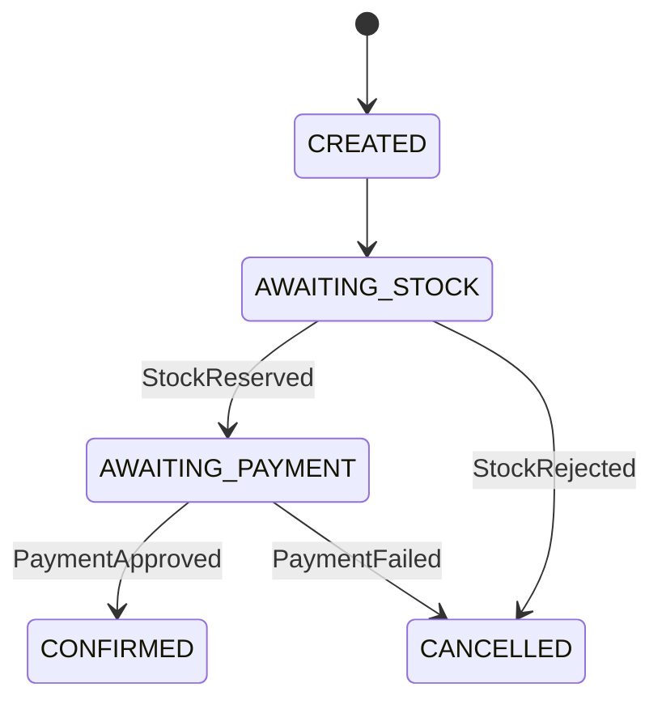

# Status do pedido



Leia de cima para baixo. `CONFIRMED` e `CANCELLED` são finais. O meio pode passar rápido demais para um único GET.

Fluxo da saga (Kafka):

```
CREATED
  -> AWAITING_STOCK
       -> STOCK_RESERVED -> AWAITING_PAYMENT
            -> PAYMENT_APPROVED -> CONFIRMED
            -> PAYMENT_FAILED   -> CANCELLED
       -> STOCK_REJECTED -> CANCELLED
```

Eventos:
- `orders.events`: OrderCreated, OrderConfirmed, OrderCancelled
- `inventory.events`: StockReserved, StockRejected
- `payments.events`: PaymentApproved, PaymentFailed

Falhas injetáveis (QA):
- Header `X-Force-Payment-Failure: true` ou body `forcePaymentFailure: true`
- Estoque baixo via Admin (`/admin/stock`) ou produto `prod-raro`

Não há job que expire `AWAITING_PAYMENT`. Se o pagamento nunca responder, o pedido fica parado. Isso é lacuna do oráculo; o projeto espelho trata na semana 7 da academia.
